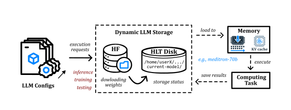
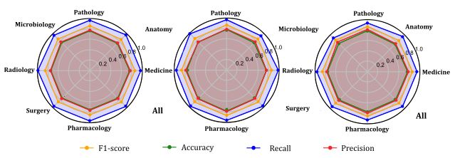
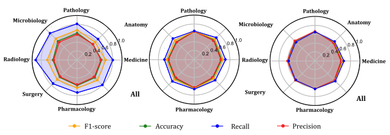
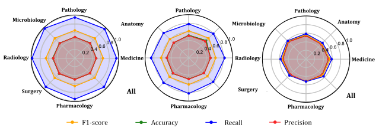
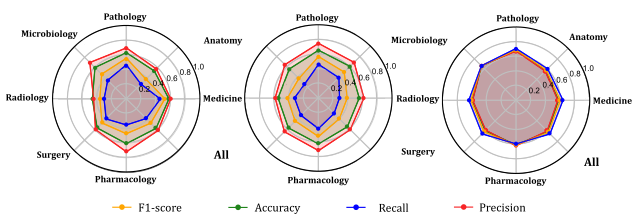
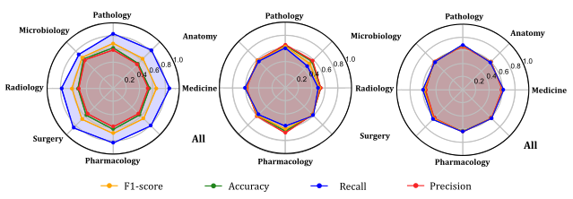

# Technical Report
This is a technical report describing all experimental tasks in virtue on testing today's medical LLMs.

## Intent of the Framework
- Evaluate medical LLMs efficiently; i.e., without wasting massive computational resources;
- Be extensible to any downstream task, namely inference and fine-tuning;
- Be configurable and malleable on loading and saving data (resp., from and to executions).

## Access Conditions

### Context 
Most models and follow-up datasets (here, exploited) are available within the HuggingFace (HF) ecosystem.
However, freely offered APIs do not support access with such model dimensions.
Thus, their loading and testing process have to be local and through the AutoModel framework, which recover and loads pretrained instances run with the ``generate()`` method.

### Infrasctruture
The following work benefited from the utilization of the INESC-ID's research cluster lincensed via membership in the HLT group. 
This computational system provides several options of memory-dedicated machines with GPU specified by Nvidia card version and VRAM capacity.

### The Proposed Solution
Once a shared resource, concerns are taken on: reducing disk usage; alleviating memory loading and space occupied LLMs in test; and optimizing the execution/inference time.
The Figure 1 schematizes all these considerations.

 

#### Storage and Disk Usage

To respect the collective disk in light of the larger required space, we follow the policy:

    "Only one LLM is stored (so, used) at any time"

 

From HF, we have a caching mechanism which lacks local control on storing multiple models separately.
In this sense, we only download the latest version of a model's repository if it is not found on the centralized directory ``current_model/``, replacing all existing content (i.e., previous pretrained files, namely the weights).
For each model we might test, a YAML file is configured with information on its source, properties for their execution option, and a storage status, saying to us:

- $\texttt{complete}$ - The model is present and is ready for being loaded to memory;
- $\texttt{started}$ - The system makes a remote call to the target HF repository and resume the installation;
- $\texttt{uninitialized}$ - ... or reset it.

**A Fact:** Running models in sequence, as executions, hold less network impact than downloading the whole experimental set at once; and much less if these executions are well-prior configurated.
       
#### Memory Utilization

Suppose that a GPU is available for the time of our experiments with $\texttt{meditron-70b}$ model.
Either such hardware cannot handle it (and it slowly continues assisted by the CPU), or VRAM usage levels spike for loading 70 billion parameters (approx. 140GB in float-16bit precision).

So as not to leave our model in the lurch, we make use of 4-bit quantization.
This technique allows us to reduce the float-wise weight dimension from the traditional 16 bits to its fourth part without implying output quality degradation rated proportionally.
Thus, it becomes possible to fit our testing models on ≈40GB-VRAM without weight offloading.

#### Execution/Inference Time

The execution duration is an important factor to consider in the presence of an overwhelming volume of requests to test LLMs (given their access costs), namely for chatbot dialogues.

As an active research area, techniques for optimizing inference times have given special attention to large text generation while keeping the performance.
Besides recent extensions relying on verifying token-sequence proposals by an extra small language model, caching every computed KV pair for each decoder iteration step is the original unbiased option and has the advantage of reusing matrix operations, which cannot be parallelized by GPU given the sequential auto-regressive nature of those models.
Therefore, with a single computation, each generated token updates the attention probabilities, turning suitable executions for large prompts.
We enable the KV cache by passing $\texttt{use\_cache}=\mathrm{True}$ in the ``generate()`` method.

As such, to accommodate experiments, the chosen available architecture is 1 Nvidia A100 - 80 VRAM.

## Tool Guide

### 📦| Installation

### 🧑🏻‍💻| Execution & Use 

## Details Behind Implemented Tasks

### T1 | 0-shot Inference

#### Generation Parameters

#### Results

### T2 | Fine-Tuning for Enforcing  Error Detection

#### Dataset Preprocessing

1. Splitting MCQs into QA pairs turned out in bias for the ``incorrect`` class.

 

2. Balacing class variable towards a fair error detection. Considered validation dataset is the one for (a).

    (a) Undersampling
    

    
    

    (b) Class-weighted loss function
    

    
    

3. Similar questions removal (with cosine of embeddings followed by BLEURT similarities).

 

4. Mystification of QA relations by transforming MCQs into single-answer questions.

 

#### Results
